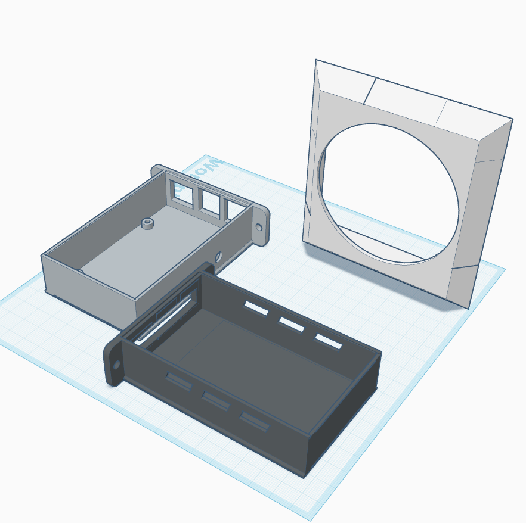
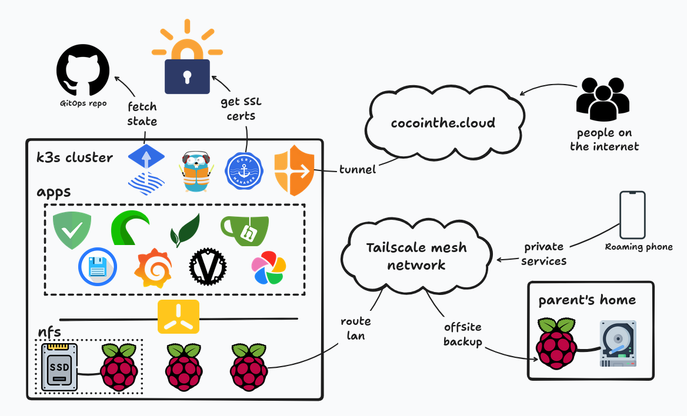

# lampone

My self hosted cloud, available at [cocointhe.cloud](https://cocointhe.cloud).


<div align="center">


<br>


<br>


</div>

<details>
<summary><h3>Hardware specs</h3></summary>

Hardware:
- 3 [raspberry pi 4 (8Go)](https://www.raspberrypi.com/products/raspberry-pi-4-model-b/)
- 1 [gigabit ethernet 5 ports switch](https://www.tp-link.com/home-networking/soho-switch/tl-sg105/)
- 1 [1To lexar ES3 usb SSD](https://www.lexar.com/products/Lexar-ES3-Portable-SSD/)
- 1 [80mm fan](https://www.thermalright.com/product/tl-8015w/)
- 3 25cms cat6 ethernet cables
- a very short usb-c 10gbps cable
- some m3 threaded inserts and screws
- a 3d printed rack

The 3d files are available in `3d`. This is a remix of [this rack](https://makerworld.com/en/models/180806-raspberry-pi-4-5-mini-server-rack-case). I've included the stls that I remixed/designed, aka the vented sleds for the PI and the SSD, and the side fan mount.



</details>


<details>
<summary><h3>Software details and architecture</h3></summary>

Here is a top view diagram of the main components:



This is the repo that governs almost all the cluster. The bootstrapping is done using ansible, from 3 ssh-available machines (pi4 in this case).

From here, Flux will create everything that is declared in `k8s/`, decrypt what's secret using a private key, and keep the stack in sync.

In `k8s/` there are 2 main folders:
- `infra` that represents what's needed for the cluster to function:
  - a storageclass through a nfs provisionner,
  - an IngressController with Traefik (actually 2, one private one public)
  - cert-manager for pulling certs for my domain
  - cloudflare tunnel for exposing part of my services to the outside world
  - tailscale (not deployed using gitops - yet) for accessing my private services from wherever

- an `apps` folder, that's composed of the actual services running on the cluster:
  - [adguard](https://github.com/AdguardTeam/AdGuardHome) for DNS/DHCP
  - [gitea](https://github.com/go-gitea/gitea) for local git and CI/CD
  - [paperless-ngx](https://github.com/paperless-ngx/paperless-ngx) for my important files
  - [immich](https://github.com/immich-app/immich) for photos backups and sync
  - [vaultwarden](https://github.com/dani-garcia/vaultwarden) as my passwords manager
  - [filebrowser](https://github.com/filebrowser/filebrowser) for file sharing
  - [glance](https://github.com/glanceapp/glance) as my internet homepage
  - [kromgo](https://github.com/kashalls/kromgo) for exposing stats publicly
  - [octoprint](https://github.com/OctoPrint/OctoPrint) for controlling my 3D printer
  - and some other stuff like monitoring, a blog , static sites, etc..

</details>


## deployment

I try to adhere to gitops/automation principles.
Some things aren't automated but it's mainly toil (things during setup, ).
95% of the infrastructure should be deployable by following these instructions (assuming data and encryption keys are known).

Requirements and basic stack:
- ansible: infrastructure automation
- flux: cluster state mgmt
- sops + age: encryption
- git: change management

```
brew install git ansible fluxcd/tap/flux sops age
```


### Creating the cluster

It is assumed that a ssh key auth is configured on the nodes (ssh-copy-id <ip>),
with passwordless sudo (`<user> ALL=(ALL) NOPASSWD: ALL` in visudo).

```
cd ansible
ansible-playbook -i inventory.yaml cluster-install.yaml
```


## Deploying the services

1. Get a github token and set an env var:

```fish
export GITHUB_TOKEN=xxx
```

2. Enter some commands
```fish
# pre create the decryption key
kubectl create ns flux-system
kubectl create secret generic sops-age --namespace=flux-system --from-file=age.agekey

# bootstrap flux
flux bootstrap github \
              --owner=k0rventen \
              --repository=lampone \
              --branch=main \
              --path=./k8s/flux
```

3. Things should start to deploy !


## k3s update

To update the cluster, set the `k3s_version` in the ansible inventory (should be updated by renovate), then:
```
ansible-playbook -i inventory.yaml cluster-update.yaml
```
Follow along with `k get nodes -w`.


## backup strategy

I try to follow a 3-2-1 backup rule. The 'live' data is on the nfs ssd.
It's backed up daily onto the same ssd (mainly for rollbacks and potential local re-deployments).
For disaster-recovery situations, it's also backed up daily onto a HDD offsite, which can be accessed through my tailnet.

The backup tool is [restic](https://restic.net/) . It's installed and configured onto the nfs server using ansible. There is a 'sidecar' unit that sends a report through discord if the backup fails.

1. Init the local repo

```
cd /nfs
restic init nfs-backups
```

2. Init the remote repo

Create a `mnt-backup.mount` systemd service on the remote server to mount/umount the backup disk
```
coco@remote_server:~ $ cat /etc/systemd/system/mnt-backup.mount
[Unit]
Description=Restic Backup External Disk mount

[Mount]
What=/dev/disk/by-label/backup
Where=/mnt/backup
Type=ext4
Options=defaults

[Install]
WantedBy=multi-user.target
```

Init the repo from the nfs server (this assumes passwordless ssh auth):
```
restic init -r sftp:<remote_server_ip>:/mnt/backup/nfs-backups
```

3. Create a systemd cred with the repo password (on the nfs server) and set the value of `restic_systemd_creds` in the ansible inventory:
```
> systemd-ask-password -n | sudo systemd-creds encrypt --name=restic -p - -
🔐 Password: *************************
SetCredentialEncrypted=restic: \
        ...
```

4. Get the discord webhook token and set the `discord_webhook` key in the inventory accordingly.

5. Deploy the restic config using ansible:

```
ansible-playbook -i inventory restic-install.yaml
```

<details>
<summary><h3> Staging / tests env (WIP)</h3></summary>

A staging environment can be deployed using vagrant:

Prerequisites:
```

sudo apt install virtualbox vagrant --no-install-recommends
```

Then in `staging/`
```
# launch
vagrant up

# add the nodes ssh config
vagrant ssh-config >> .ssh/config

# get the kubectl config
vagrant ssh -c "kubectl config view --raw" staging-master > .kube/configs/staging

# test
kubectl get no
```

Then bootstrap the cluster using flux from [this section](#deploying-the-services).

</details>
