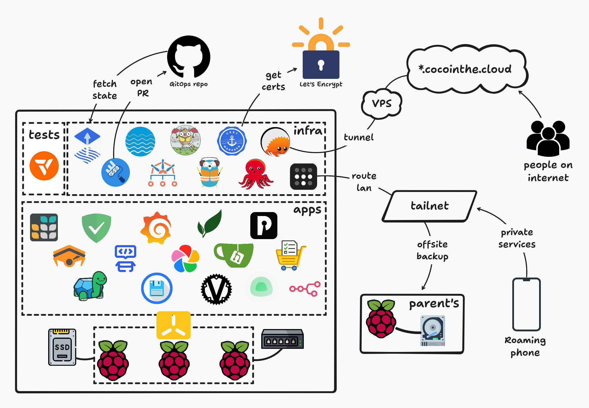

<div align="center">


<h1>lampone</h1>

My self hosted cloud, available at [cocointhe.cloud](https://cocointhe.cloud).

<br>


<br>


<br>


</div>


## Hardware

This is what the cluster looks like:

<div align="center">


</div>

What it's made of:

- 3 [raspberry pi 4 (8Go)](https://www.raspberrypi.com/products/raspberry-pi-4-model-b/)
- 1 [gigabit ethernet 5 ports switch](https://www.tp-link.com/home-networking/soho-switch/tl-sg105/)
- 1 [1To lexar ES3 usb SSD](https://www.lexar.com/products/Lexar-ES3-Portable-SSD/)
- 1 [80mm fan](https://www.thermalright.com/product/tl-8015w/)
- 3 very short cat6 ethernet cables
- a [3d printed rack](https://github.com/k0rventen/lampone/tree/main/resources/3d)
- some m3 threaded inserts and screws

The rack is a remix of [this one](https://makerworld.com/en/models/180806-raspberry-pi-4-5-mini-server-rack-case). I've included the [stls here](https://github.com/k0rventen/lampone/tree/main/resources/3d) that I remixed/designed, aka the vented sleds for the PI4 and the SSD, and the side fan mount.


## Software

Here is a top view diagram of the main components:



The Kubernetes cluster is deployed with [k3s](https://github.com/k3s-io/k3s).

The cluster state is handled by [fluxcd](https://fluxcd.io/), based on what's in this repo.

In `k8s/` there are 2 main folders:
- `infra` represents what's needed for the cluster to function:
  - a [nfs-server](https://github.com/k0rventen/docker-nfs-server) + [csi-nfs-driver](https://github.com/kubernetes-csi/csi-driver-nfs) for handling persistent volumes,
  - an IngressController with [Traefik](https://github.com/traefik/traefik), one private (listens on local lan), one "public" (routes specific subdomains from cloudflare),
  - [cert-manager](https://github.com/cert-manager/cert-manager) for certificates management of my domain,
  - [kube-vip](https://github.com/kube-vip/kube-vip) for managing the cluster's VIP.  
  - [cloudflare tunnel](https://github.com/cloudflare/cloudflared) for exposing part of my services to the outside world,
  - [tailscale-operator](https://github.com/tailscale/tailscale/tree/main/cmd/k8s-operator/deploy) for accessing my private services from wherever (using a subnet route) and for my cluster services to access my offsite backup server
  - [system-upgrade-controller](https://github.com/rancher/system-upgrade-controller) for managing k8s upgrades directly in the cluster using CRDs.
  - a [renovate](https://github.com/renovatebot/renovate) cronjob to create PR for components updates (w/ auto merging when it's a patch level update)
  - a [restic](https://github.com/restic/restic) cronjob that create the local backup (if an app fails and borks its files) and remote backup (if the server catches fire)


- `apps`, the actual services running on the cluster:
  - [adguard](https://github.com/AdguardTeam/AdGuardHome) for DNS/DHCP
  - [gitea](https://github.com/go-gitea/gitea) for local git and CI/CD
  - [paperless-ngx](https://github.com/paperless-ngx/paperless-ngx) for my important files
  - [immich](https://github.com/immich-app/immich) for photos backups and sync
  - [vaultwarden](https://github.com/dani-garcia/vaultwarden) as my passwords manager
  - [filebrowser](https://github.com/gtsteffaniak/filebrowser) for file sharing
  - [glance](https://github.com/glanceapp/glance) as my internet homepage
  - [kromgo](https://github.com/kashalls/kromgo) for exposing prom stats publicly
  - [pocketid](https://github.com/pocket-id/pocket-id) as an OIDC provider
  - [atuin](https://github.com/atuinsh/atuin) for my centralized shell history
  - [uptime kuma](https://github.com/louislam/uptime-kuma) as a simple availability dashboard
  - [n8n](https://github.com/n8n-io/n8n) for basic automation workflows
  - [bytestash](https://github.com/jordan-dalby/ByteStash) for remembering short code/iaac snippets 
  - [grafana](https://github.com/grafana/grafana) + [prometheus](https://github.com/prometheus/prometheus) + [loki](https://github.com/grafana/loki) for monitoring
  - and some other stuff like a blog , static sites, etc..

- there is also an `appchart` folder. It's a Helm chart that ease the deployment of simple services.


## Deployment

I try to adhere to gitops/automation principles.
Some things aren't automated but it's mainly toil (one-time-things during setup etc..).
99% of the infrastructure should be deployable by following these instructions (assuming data and encryption keys are known).

Requirements and basic stack:
- [ansible](https://docs.ansible.com/): infrastructure automation
- [flux](https://fluxcd.io/flux/): cluster state mgmt
- [sops](https://github.com/getsops/sops) + [age](https://github.com/FiloSottile/age/): encryption
- [git](https://git-scm.com/): change management

```
brew install git ansible fluxcd/tap/flux sops age
```

### OS

The 3 rasps are running [Raspberry Pi OS Lite 64b](https://www.raspberrypi.com/software/operating-systems/). From there unnecessary packages are removed (dphys-swapfile, avahi-daemon ,modemmanager and some others). 


### Creating the cluster

The bootstrapping is done using [ansible](https://docs.ansible.com/). The playbook will simply install k3s on all the nodes.

It is assumed that a ssh key auth is configured on the nodes (ssh-copy-id <ip>),
with passwordless sudo (`<user> ALL=(ALL) NOPASSWD: ALL` in visudo).

```
cd ansible
ansible-playbook -i inventory.yaml -l lampone cluster-install.yaml
```


### Deploying the stack

1. Get a github token and set an env var:
    ```fish
    export GITHUB_TOKEN=xxx
    ```

2. Enter some commands
    ```fish
    # pre create the decryption key
    kubectl create ns flux-system
    kubectl create secret generic sops-age --namespace=flux-system --from-file=age.agekey

    # bootstrap flux
    flux bootstrap github \
                  --owner=k0rventen \
                  --repository=lampone \
                  --branch=main \
                  --path=./k8s/flux
    ```

3. From here, Flux will create everything that is declared in `k8s/`, decrypt what's secret using the private key, and keep the stack in sync.

## SOPS setup

This assume you have the decryption key `age.agekey`, and the env var configured:

```
SOPS_AGE_KEY_FILE=age.agekey
```

If you want to encrypt an already created file (eg a k8s Secret spec):

```
sops encrypt -i <file.yaml>
```

If you want to edit inline a encrypted file (eg modify a value in a encrypted Secret/Configmap) using $EDITOR:

```
sops <file.yaml>
```

## OIDC-based ssh access w/ opkssh

Whenever possible, authentification is managed through my OIDC provider (pocketID). That's true for most of the services in the cluster, but also for accessing infrastructure-level stuff like my servers, using  [opkssh](https://github.com/openpubkey/opkssh).

1. On the OIDC provider, create a new app w/ a Public Client ID (no client secret).

2. On the client, install opkssh and in `.opk/config.yaml`, add the provider w/ the public client id as per the doc.

3. On the servers, install using the script:
    ```bash
    wget -qO- "https://raw.githubusercontent.com/openpubkey/opkssh/main/scripts/install-linux.sh" | sudo bash
    ```
    Add a provider in `/etc/opk/providers`, then add a user to the policy with `sudo opkssh add local_user oidc_email  https://oidc-provider`. This means that the user with `oidc_email` will be able to log in as `local_user`.

4. On the client, do a `opkssh login` then ssh should be seamless.

## Backup strategy

I try to follow a 3-2-1 backup rule. The 'live' data is on the nfs ssd.
It's backed up daily onto the same ssd (mainly for rollbacks and potential local re-deployments).
For disaster-recovery situations, it's also backed up daily onto a HDD offsite, which can be accessed through my tailnet.

The backup tool is [restic](https://restic.net/). It's deployed as a cronjob in the cluster. It launches a custom script that runs the local backup as well as the remote one (which requires commands before and after to mount the external disk on the remote side.). Here are the commands used to create the restic repos before deploying the cronjob:

1. local repo

```
cd /nfs
restic init nfs-backups
```

2. remote repo

Create a `mnt-backup.mount` systemd service on the remote server to mount/umount the backup disk
```
coco@remote_server:~ $ cat /etc/systemd/system/mnt-backup.mount
[Unit]
Description=Restic Backup External Disk mount

[Mount]
What=/dev/disk/by-label/backup
Where=/mnt/backup
Type=ext4
Options=defaults

[Install]
WantedBy=multi-user.target
```

Init the repo from the nfs server (this assumes passwordless ssh auth):
```
restic init -r sftp:<remote_server_ip>:/mnt/backup/nfs-backups
```
